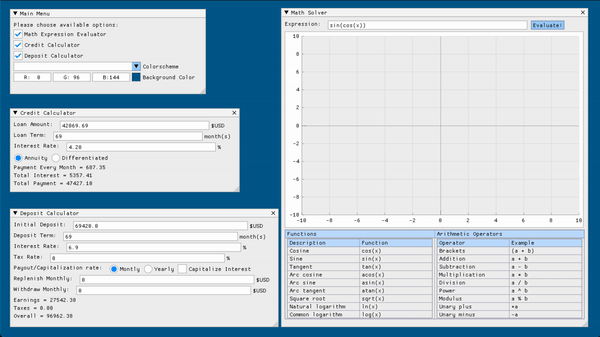

# Math Solver



### Table of Contents
* [Introduction](#introduction)
* [Features](#features)
* [Goals](#goals)
* [Build](#build)
* [Tests](#tests)

### Introduction

Implementation of the **math solver** in C following the principles of structured programming. In addition to basic arithmetic operations, the calculator features the *mathematical functions*, *x variable* and *graphing*.

### Features
<table>
<tr><th>Functions</th><th>Arithmetic Operators</th></tr>
<tr><td>

| Function description | Function |
| ------ | ------ |
| Cosine | cos(x) |
| Sine | sin(x) |
| Tangent | tan(x) |
| Arc cosine | acos(x) |
| Arc sine | asin(x) |
| Arc tangent | atan(x) |
| Square root | sqrt(x) |
| Natural logarithm | ln(x) |
| Common logarithm | log(x) |

</td><td>

| Operator | Example |
| --------- | ------ |
| Brackets | (a + b) |
| Addition | a + b |
| Subtraction | a - b |
| Multiplication | a * b |
| Division | a / b |
| Power | a ^ b |
| Modulus | a mod b |
| Unary plus | +a |
| Unary minus | -a |

</td></tr> </table>

**BONUS**: You can find Credit & Debit calculators as well ;)

### Goals

- [ ] CMake integration
- [ ] GUI based on Dear ImGui
- [ ] Shunting-Yard algorithm.
- [ ] String validation algorithm.
- [ ] Credit calculator
- [ ] Debit calculator
- [ ] Unit Tests 
- [ ] Add previews & tests to README

### Build

```
$ git clone https://github.com/bezlant/s21_math_solver
$ cd s21_math_solver/src
$ make
```

### Tests
* Unit tests are implemented using [Check](https://libcheck.github.io/check/) & coverage report with [LCOV](https://github.com/linux-test-project/lcov)


